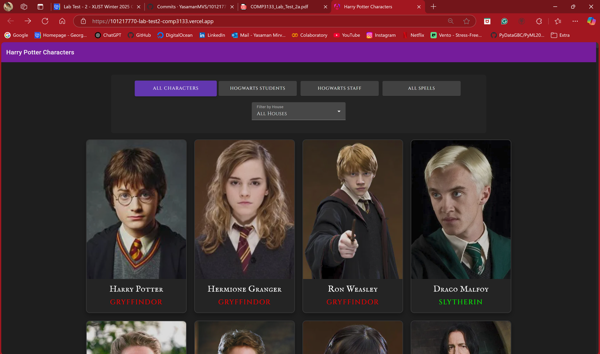
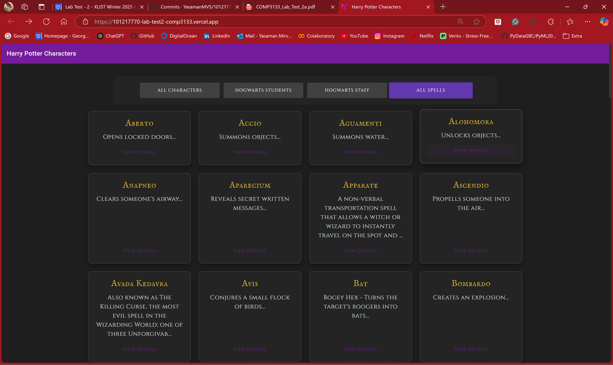
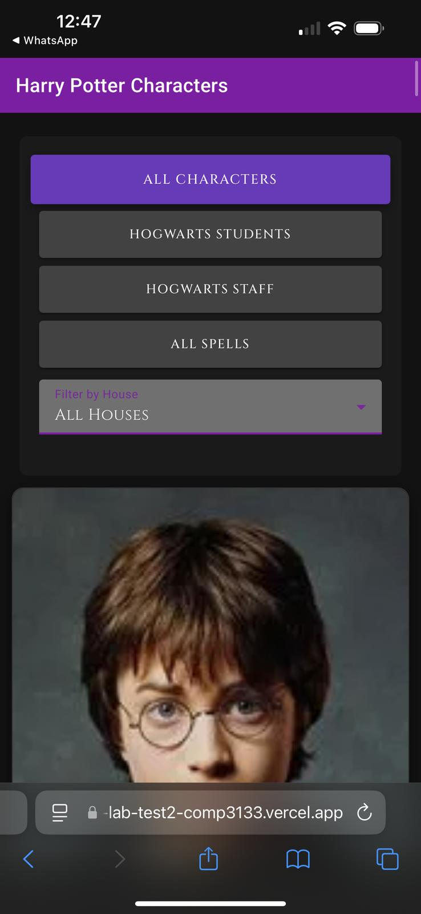
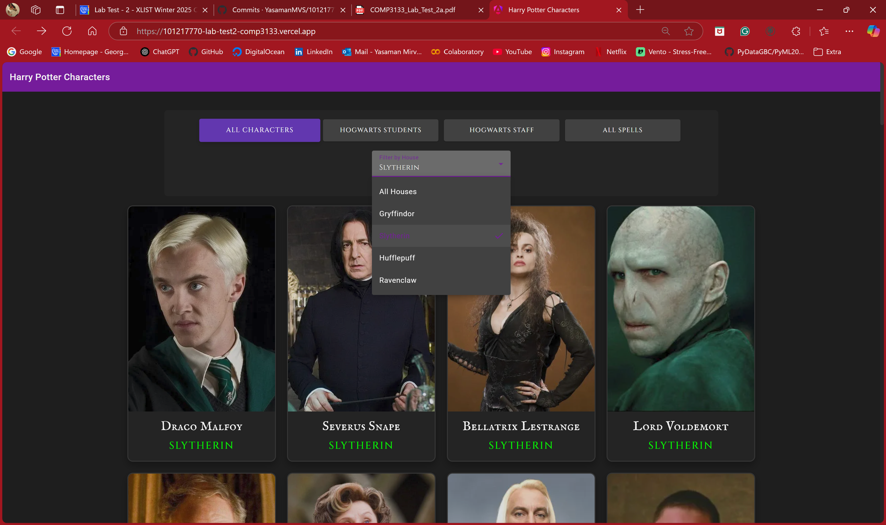
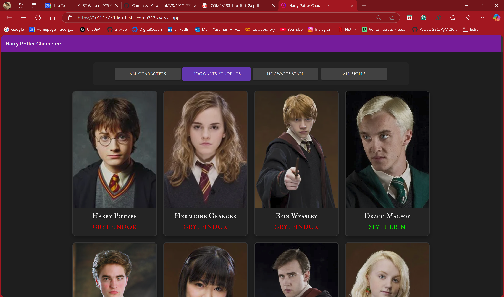

# Harry Potter Characters App

This Angular application allows users to explore characters and spells from the Harry Potter universe. Built with Angular Material and powered by the Harry Potter API.

## Features

- **Character Filtering**: Filter characters by:
  - All Characters
  - Hogwarts Students
  - Hogwarts Staff
  - House Selection (Gryffindor, Slytherin, Hufflepuff, Ravenclaw)
- **Spell Collection**: Browse through all spells in the Harry Potter universe
- **Responsive Design**: Fully responsive layout that works on mobile, tablet, and desktop
- **Dark Theme**: Beautiful dark theme with magical fonts and styling

## Technologies Used

- Angular 16
- Angular Material
- TypeScript
- SCSS
- Harry Potter API

## Installation

1. Clone the repository:
```bash
git clone https://github.com/YasamanMVS/101217770-lab-test2-comp3133.git
```

2. Install dependencies:
```bash
cd 101217770-lab-test2-comp3133
npm install
```

3. Run the development server:
```bash
ng serve
```

4. Open your browser and navigate to `http://localhost:4200`

## Screenshots

### Desktop View




### Mobile View


### Filtering Features



## Live Demo

The application is deployed and can be accessed at: (https://101217770-lab-test2-comp3133.vercel.app/)

## Development Process

1. **Initial Setup**:
   - Created Angular project with Material UI
   - Implemented basic routing and components
   - Set up Harry Potter API service

2. **Feature Implementation**:
   - Character listing and filtering
   - Spell collection display
   - Responsive grid layout
   - Dark theme styling

3. **UI/UX Improvements**:
   - Added magical fonts (IM Fell English SC, Cinzel)
   - Enhanced card hover effects
   - Implemented responsive design
   - Added loading states and error handling

4. **Deployment**:
   - Configured for Vercel deployment
   - Optimized build settings
   - Ensured proper routing configuration

## Future Enhancements

- Add character search functionality
- Implement spell categories and filtering
- Add character comparison feature
- Include more detailed character information
- Add spell animations and effects

## Author

Yasaman Mirvahabi Sabet
Student ID: 101217770
